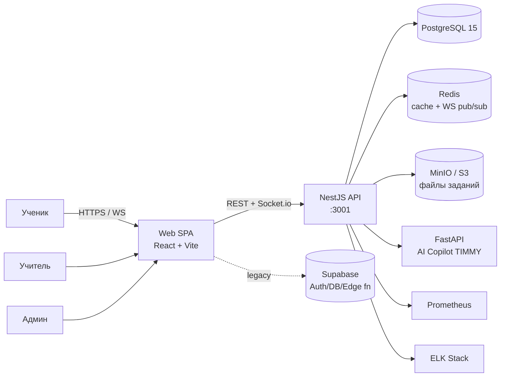
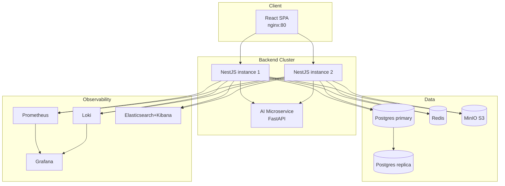
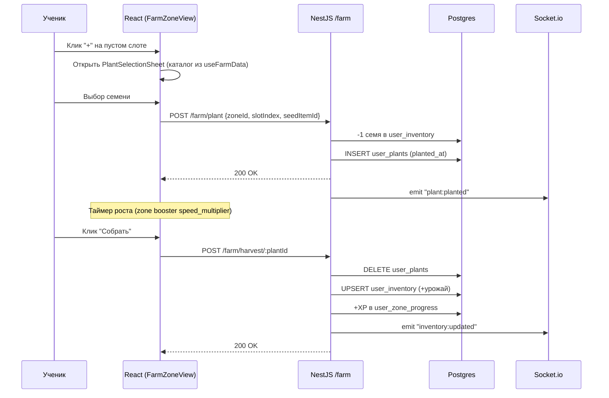
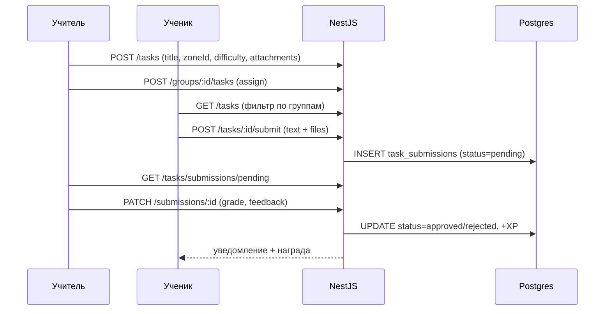
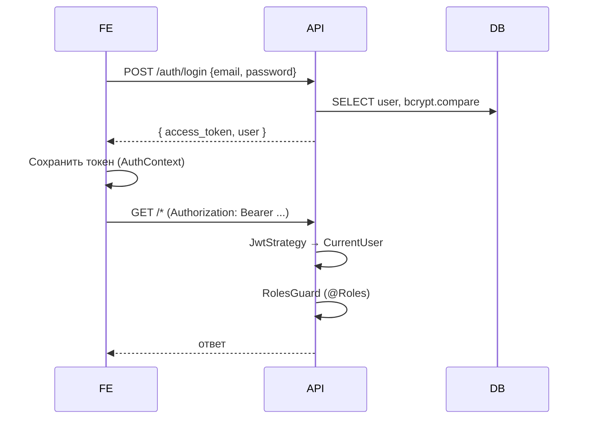
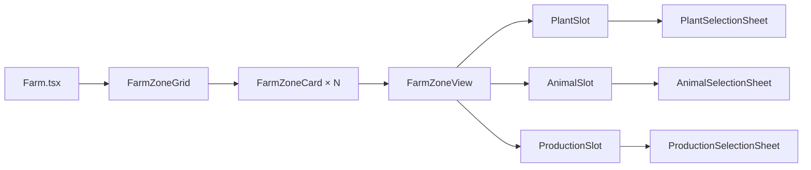
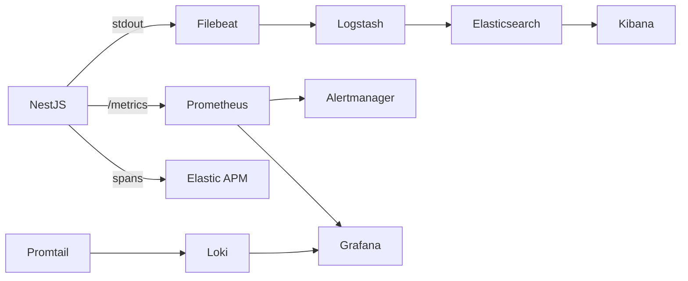
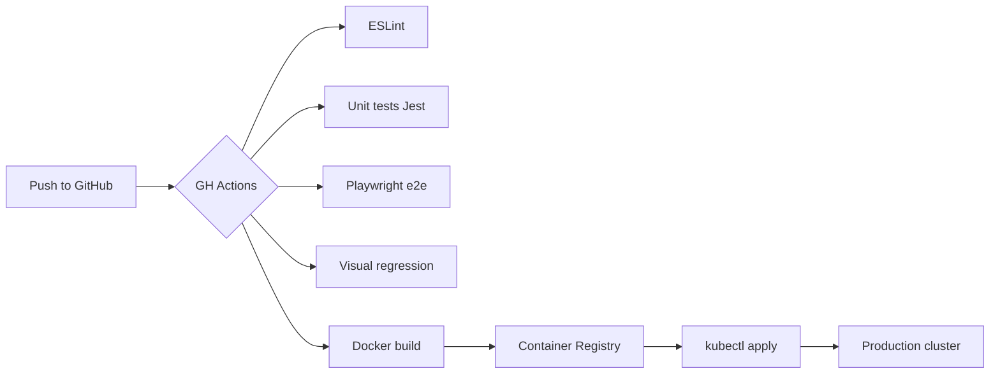

# EduFarm — Полный анализ проекта

> Образовательная игровая платформа: ученики выполняют учебные задания и развивают виртуальную ферму, разделённую на тематические зоны (биология, физика, химия, математика, IT). Учителя выдают задания, проверяют сдачи и ведут аналитику.

Документ агрегирует архитектуру, стек, доменную модель, потоки данных, инфраструктуру и операционные процессы. Все диаграммы — на Mermaid (рендерятся в GitHub).

---

## 1. Технологический стек

### Frontend
- **React 18 + TypeScript 5 + Vite 5**
- **Tailwind CSS v3** + **shadcn/ui** (Radix UI primitives)
- **TanStack Query v5** — серверный кэш / запросы
- **React Router v6**, **React Hook Form + Zod**
- **Socket.io-client** — реалтайм (ферма, питомец)
- **Recharts**, **jsPDF**, **html2canvas** — отчёты/графики
- **Sentry + LogRocket** — мониторинг фронта
- **@supabase/supabase-js** — legacy-доступ, постепенно убирается

### Backend (NestJS, модульный монолит)
- **NestJS 10** + **TypeORM** + **PostgreSQL 15**
- **JWT** (Passport: jwt + local), **bcrypt**
- **Socket.io** + **Redis adapter** (горизонтальное масштабирование WS)
- **Cache Manager + ioredis**, **@nestjs/throttler** (rate-limit)
- **AWS SDK S3** / **MinIO** — хранилище файлов
- **Swagger** (OpenAPI), **Winston** (логи), **prom-client** (Prometheus метрики)
- **Jest** (unit + e2e через supertest)

### Инфраструктура
- **Docker Compose** для локальной разработки (postgres, redis, minio, backend, frontend)
- **Kubernetes** манифесты (`k8s/`) — namespace, deployment, service, ingress, hpa, secrets
- **Postgres HA** (primary/replica, `docker-compose.postgres-ha.yml`)
- **ELK** (Elasticsearch, Logstash, Kibana, Filebeat, Metricbeat, APM) — централизованное логирование
- **Prometheus + Grafana + Loki + Promtail + Alertmanager** — мониторинг
- **GitHub Actions** — CI/CD + visual regression
- **Playwright** — e2e + визуальные тесты
- **Nginx** — reverse proxy для фронта

### Параллельный backend
Изначально проект был на **Supabase** (Postgres + Auth + RLS + Edge Functions). Сейчас идёт **миграция на собственный NestJS + Postgres**. Часть данных и RLS-политики ещё живут в Supabase (см. supabase/migrations), но в коде frontend подключается к NestJS через `src/lib/api-client.ts` (`localhost:3001`).

---

## 2. Структура репозитория

```
.
├── backend/                  # NestJS API (модули по доменам)
│   ├── src/modules/{auth,users,zones,farm,pet,tasks,achievements,
│   │                progress,groups,storage,monitoring,health}
│   ├── src/database/seeds/   # сиды стартовых данных
│   ├── src/migrations/       # TypeORM миграции
│   └── test/                 # e2e тесты
├── src/                      # Frontend (React + Vite)
│   ├── pages/                # маршруты (Farm, Pet, Tasks, Dashboard ...)
│   ├── components/{farm,teacher,achievements,analytics,chat,layout,ui}
│   ├── hooks/                # useAuth, useFarmApi, useFarmData, usePetApi ...
│   ├── contexts/AuthContext.tsx
│   ├── lib/api-client.ts     # обёртка fetch + JWT
│   └── integrations/supabase # legacy клиент
├── supabase/                 # legacy миграции и edge-функции
├── e2e/                      # Playwright сценарии
├── k8s/                      # Kubernetes манифесты
├── monitoring/, elk/         # Observability стеки
├── postgres/                 # HA конфигурации Postgres
└── docker-compose*.yml       # Локальная инфраструктура
```

---

## 3. Архитектура высокого уровня (C4 — System Context)



## 4. Контейнерная диаграмма (C4 — Containers)



---

## 5. Модули backend

| Модуль | Назначение | Ключевые сущности |
|---|---|---|
| **auth** | JWT-аутентификация (signup/login), Passport стратегии | User |
| **users** | CRUD пользователей, профили | User, Profile |
| **zones** | Тематические зоны фермы (biology/physics/...) | FarmZone, UserZoneProgress |
| **farm** | Растения, животные, производственные цепочки, бустеры, инвентарь, WS обновления | FarmItem, UserPlant, FarmAnimal, UserFarmAnimal, ProductionChain, ProductionChainIngredient, UserProduction, UserInventory, ZoneBooster, UserActiveBooster |
| **pet** | Виртуальный питомец TIMMY (стат-логика in-memory) | Pet, PetShopItem, UserPetItem |
| **tasks** | Задания учителей, сдачи, проверки | Task, TaskSubmission, SubmissionComment, CommentTemplate |
| **achievements** | Достижения и условия | Achievement, UserAchievement |
| **progress** | XP / уровни ученика по зонам | UserZoneProgress |
| **groups** | Учебные группы и назначение заданий | StudentGroup, GroupMember, GroupTask |
| **storage** | Загрузка файлов (multer-independent abstraction) | UploadedFile |
| **monitoring** | Prometheus метрики, админ-статистика | — |
| **health** | Healthchecks для k8s | — |

Глобально: `JwtAuthGuard`, `RolesGuard` + декораторы `@CurrentUser`, `@Roles('admin'|'teacher'|'student')`, `HttpExceptionFilter`, `LoggingInterceptor`, `PrometheusInterceptor`. WebSocket — отдельный `WsJwtGuard` + `WebsocketLoggerMiddleware`, Redis-adapter.

---

## 6. Доменная модель (ER-диаграмма)

```mermaid
erDiagram
    USERS ||--|| PROFILES : has
    USERS ||--o{ USER_ROLES : has
    USERS ||--o{ TASK_SUBMISSIONS : submits
    USERS ||--o{ USER_INVENTORY : owns
    USERS ||--o{ USER_PLANTS : grows
    USERS ||--o{ USER_FARM_ANIMALS : keeps
    USERS ||--o{ USER_PRODUCTIONS : runs
    USERS ||--o{ USER_ACTIVE_BOOSTERS : activates
    USERS ||--o{ USER_ZONE_PROGRESS : progresses
    USERS ||--o{ USER_ACHIEVEMENTS : unlocks
    USERS ||--o| PETS : owns
    USERS ||--o{ USER_FARM_SLOTS : unlocks

    FARM_ZONES ||--o{ FARM_ITEMS : contains
    FARM_ZONES ||--o{ FARM_ANIMALS : contains
    FARM_ZONES ||--o{ PRODUCTION_CHAINS : contains
    FARM_ZONES ||--o{ ZONE_BOOSTERS : has
    FARM_ZONES ||--o{ TASKS : categorizes
    FARM_ZONES ||--o{ USER_ZONE_PROGRESS : tracked

    FARM_ITEMS ||--o{ USER_INVENTORY : stocked
    FARM_ITEMS ||--o{ USER_PLANTS : seed
    FARM_ITEMS ||--o{ PRODUCTION_CHAIN_INGREDIENTS : ingredient
    FARM_ANIMALS ||--o{ USER_FARM_ANIMALS : instance
    FARM_ANIMALS }o--|| FARM_ITEMS : produces
    PRODUCTION_CHAINS ||--o{ PRODUCTION_CHAIN_INGREDIENTS : recipe
    PRODUCTION_CHAINS ||--o{ USER_PRODUCTIONS : runs
    PRODUCTION_CHAINS }o--|| FARM_ITEMS : output

    ZONE_BOOSTERS ||--o{ USER_ACTIVE_BOOSTERS : activated
    ACHIEVEMENTS ||--o{ USER_ACHIEVEMENTS : awarded
    ACHIEVEMENTS ||--o{ ZONE_BOOSTERS : unlocks

    TASKS ||--o{ TASK_SUBMISSIONS : has
    TASK_SUBMISSIONS ||--o{ SUBMISSION_COMMENTS : has
    STUDENT_GROUPS ||--o{ GROUP_MEMBERS : has
    STUDENT_GROUPS ||--o{ GROUP_TASKS : assigns
    TASKS ||--o{ GROUP_TASKS : linked
    PETS ||--o{ USER_PET_ITEMS : uses
    PET_SHOP_ITEMS ||--o{ USER_PET_ITEMS : purchased
    PET_SHOP_ITEMS ||--o{ PET_SHOP_ITEM_COSTS : costs
    FARM_ITEMS ||--o{ PET_SHOP_ITEM_COSTS : required
```



Особенности схемы:
- Колонки в Postgres — **camelCase**, в RAW SQL обязательны двойные кавычки.
- Роли — отдельная таблица `user_roles` (anti-privilege-escalation), функция `has_role()` SECURITY DEFINER.
- В Supabase часть таблиц защищена RLS-политиками (см. блок `<supabase-tables>`).

---

## 7. Поток: посадка → рост → сбор урожая



Аналогичный flow для **animals** (feed → produce → collect) и **production chains** (consume ingredients → start → finish_at → claim output).

## 8. Поток: задание учителя



## 9. Auth flow



---

## 10. Frontend архитектура

- **Роутинг (`App.tsx`)** — публичные (`/auth`, `/`), защищённые `ProtectedRoute` (роль), 18 страниц.
- **State**: TanStack Query (server state) + локальные `useState`/`useReducer`. Глобальный — только `AuthContext`.
- **API-клиент** (`src/lib/api-client.ts`): обёртка `fetch`, JWT, безопасный JSON-парсинг (пустой ответ → `null`).
- **Хуки доменов**: `useFarmApi`, `useFarmData` (нормализация nested backend объектов), `useFarmRealtimeUpdates`, `usePetApi`, `useTaskNotifications`, `useUserRole`, `useAuth`.
- **Realtime** через `websocketManager.ts` (singleton Socket.io), переподключение, аутентификация JWT.
- **Дизайн-система**: семантические токены в `index.css` + `tailwind.config.ts` (HSL переменные), shadcn-компоненты с variant'ами через `class-variance-authority`.

### Карта зон фермы


---

## 11. AI Copilot TIMMY

- Отдельный микросервис **FastAPI**, принимает `system_prompt` (роль/тон) + историю сообщений.
- На фронте — `ChatWidget`, плавающая кнопка `FloatingChatButton`.
- При недоступности backend — **regex-fallback** с заранее заданными ответами (русскоязычная персона).

---

## 12. Observability



Дашборды Grafana: `edufarm-overview`, `edufarm-performance`. Алерты — `monitoring/prometheus/alerts.yml`.

---

## 13. CI/CD



---

## 14. Безопасность

- JWT в `Authorization: Bearer`, секрет из env.
- `bcrypt` хэши паролей.
- Роли в отдельной таблице (`user_roles`) + `has_role()` SECURITY DEFINER.
- RLS-политики на всех Supabase-таблицах (legacy).
- `@nestjs/throttler` rate-limit (THROTTLE_TTL/LIMIT).
- CORS строго по `CORS_ORIGIN`.
- Секреты — k8s `Secret` / env, никогда в коде.
- Storage abstraction не зависит от Express.Multer.File (см. constraint в memory).

---

## 15. Локальный запуск

```bash
docker compose up                          # postgres, redis, minio, backend, frontend
docker exec edufarm-backend npm run seed   # стартовые данные ферм/зон
# Frontend → http://localhost:5173
# Backend  → http://localhost:3001 (Swagger /api/docs)
# MinIO    → http://localhost:9001
```

---

## 16. Известные особенности / правила проекта

- Postgres колонки **camelCase** — RAW SQL только с `"кавычками"`.
- Frontend — `useAuth` для `userId`, токены не парсить вручную.
- В роутинге backend **специфичные пути перед параметризованными** (`user/submissions` до `:id`).
- Стат-логика питомца считается в памяти на GET, в БД не сохраняется.
- Все зоны фермы **разблокированы** независимо от уровня (явное правило).
- Бустеры — кросс-зональные мультипликаторы скорости с cooldown.
- Зона "mathematics" — строка ровно `mathematics` (важно для маппинга ассетов).
- Идёт миграция с Supabase на NestJS+Postgres — новых прямых запросов в Supabase **не добавлять**.

---

## 17. Roadmap микросервисов (см. `MICROSERVICES_ANALYSIS.md`)

Готовые к выделению из монолита: `auth-service`, `farm-service`, `pet-service`, `tasks-service`, `notifications-service`, `ai-copilot`. Общая шина — Redis pub/sub + Socket.io adapter.

---

_Документ собран автоматически на основе исходного кода и сопутствующих анализов (`PROJECT_ANALYSIS.md`, `INFRASTRUCTURE.md`, `MICROSERVICES_ANALYSIS.md`, `PLATFORM_DEPENDENCIES.md`)._
