# Диаграммы для ВКР: EduFarm (полный комплект)

Ниже собраны **все ключевые диаграммы** под структуру из `VKR_PLAN.md`: от предметной области до архитектуры, БД, AI и пользовательских потоков.

## 1) Схема участников системы (Context)
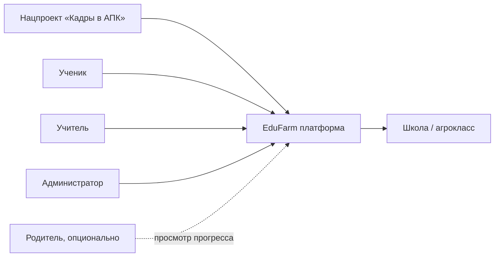

## 2) BPMN AS-IS (как обычно проходит обучение без модуля)
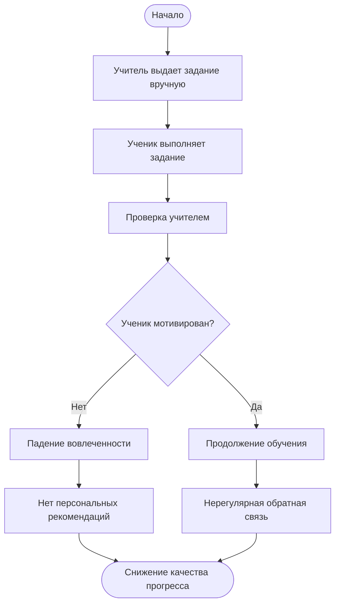

## 3) Use-Case диаграмма
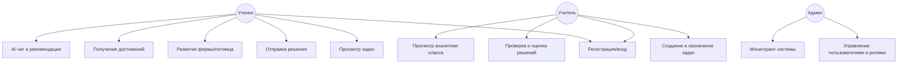

## 4) Главная архитектурная схема (C4 System Context)
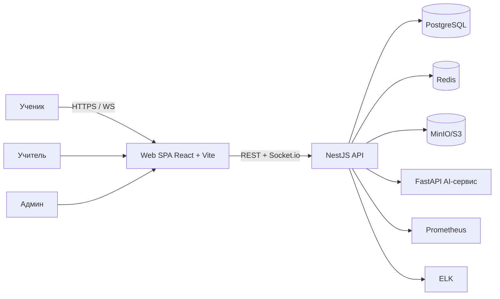

## 5) Контейнерная диаграмма (C4 Containers)
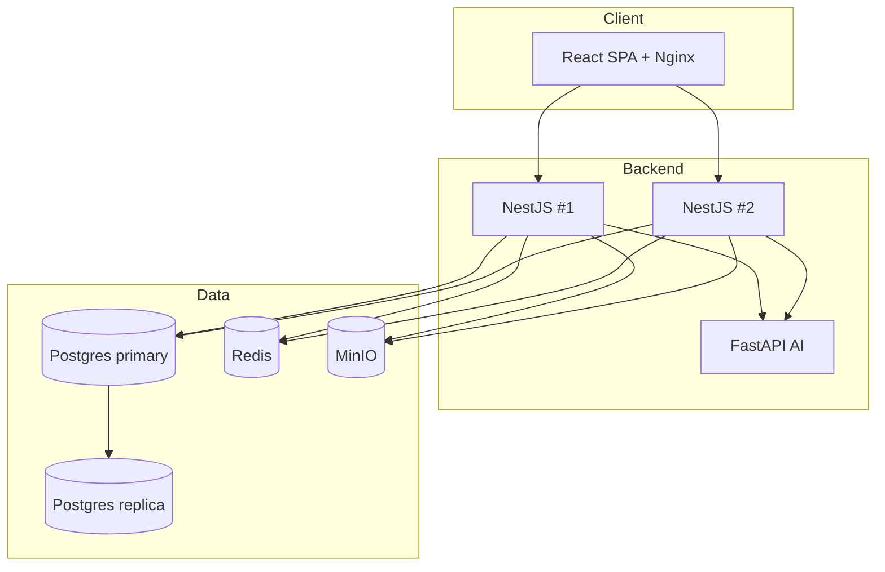

## 6) ER-диаграмма
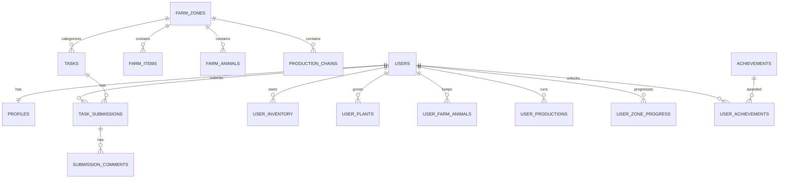

## 7) Sequence: авторизация
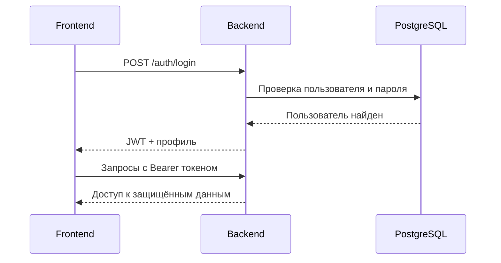

## 8) Sequence: AI-запрос
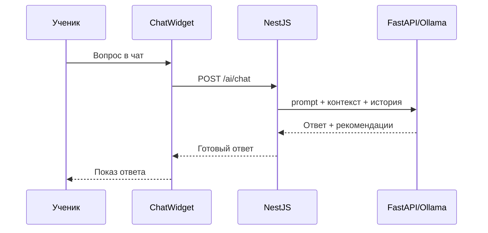

## 9) AI pipeline (обязательно для 2.4)
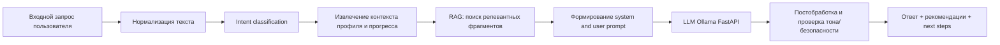

## 10) Пользовательский flow (UI)
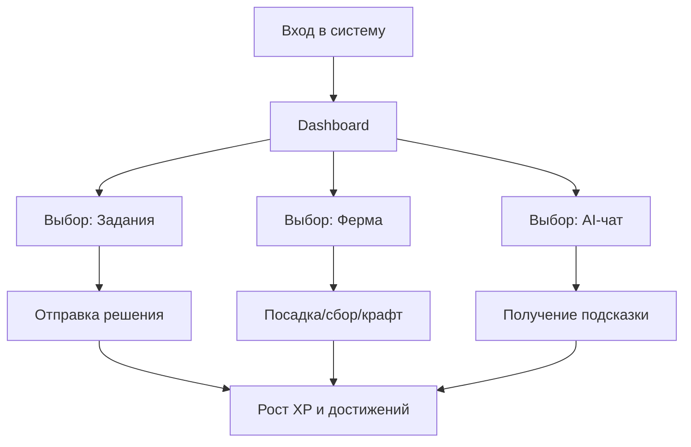

## 11) Диаграмма развертывания/наблюдаемости
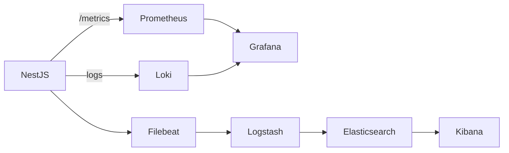

## 12) Component Diagram — взаимосвязи модулей backend
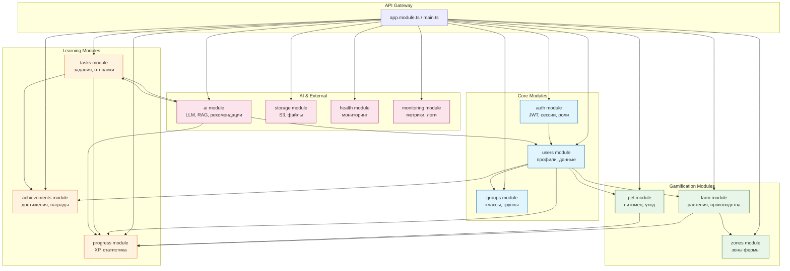

## 13) Deployment Diagram — развёртывание в Kubernetes
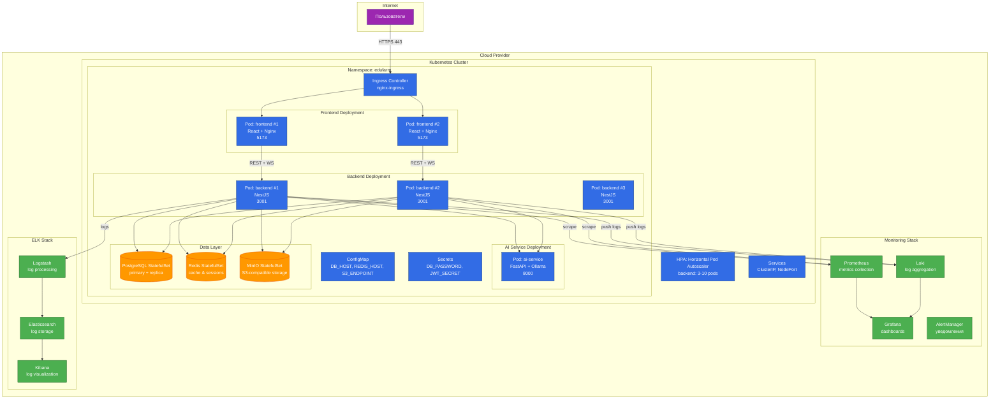

## 14) UI Mockups — ключевые экраны
### 14.1) Dashboard ученика
```mermaid
graph TB
    subgraph Header
        Logo[Логотип EduFarm]
        Nav[Навигация: Главная, Ферма, Задания, Достижения, Чат]
        Profile[Аватар + XP + Уровень]
    end
    
    subgraph MainContent
        Welcome[Добро пожаловать, Имя!]
        
        subgraph QuickStats
            XP[XP: 1250/2000]
            Level[Уровень: 5]
            Streak[Серия дней: 7 🔥]
            Rank[Место в классе: 3]
        end
        
        subgraph ActiveTasks
            Task1[📋 Биология: Фотосинтез<br/>Дедлайн: завтра]
            Task2[📋 Химия: Удобрения<br/>Дедлайн: 3 дня]
            Task3[📋 Математика: Прогрессии<br/>Новое]
        end
        
        subgraph FarmPreview
            Farm[🌾 Мини-ферма: пшеница готова!]
            Pet[🐕 Питомец: счастлив]
        end
        
        subgraph AIAssistant
            AI[💡 AI подсказка:<br/>\"Рекомендуем выполнить задание по биологии\" ]
        end
    end
    
    subgraph Sidebar
        Achievements[🏆 Последние достижения]
        Leaderboard[📊 Топ класса]
        WeeklyReport[📈 Отчёт за неделю]
    end
    
    Header --> MainContent
    MainContent --> Sidebar
```

### 14.2) Экран Фермы
```mermaid
graph TB
    subgraph FarmHeader
        Back[← Назад]
        Title[🌾 Моя ферма]
        Resources[Зерно: 45 | Молоко: 12 | Яйца: 8]
    end
    
    subgraph FarmZones
        subgraph Zone1[Зона: Поле]
            Plant1[🌾 Пшеница<br/>Готово!]
            Plant2[🌽 Кукуруза<br/>2 часа]
            Plant3[🥕 Морковь<br/>5 часов]
        end
        
        subgraph Zone2[Зона: Сад]
            Tree1[🍎 Яблоня<br/>Готово!]
            Tree2[🍐 Груша<br/>1 день]
        end
        
        subgraph Zone3[Зона: Животные]
            Animal1[🐄 Корова<br/>Молоко: готово]
            Animal2[🐔 Курица<br/>Яйца: 3 шт]
            Animal3[🐷 Свинья<br/>Рост: 60%]
        end
        
        subgraph Zone4[Зона: Производство]
            Prod1[🍞 Пекарня<br/>Хлеб: 2 часа]
            Prod2[🧀 Сыроварня<br/>Сыр: 6 часов]
        end
    end
    
    subgraph FarmActions
        Plant[➕ Посадить]
        Harvest[🌾 Собрать урожай]
        Feed[🌾 Покормить]
        Craft[🔨 Произвести]
        Upgrade[⬆️ Улучшить зону]
    end
    
    subgraph Quests
        Daily[📋 Ежедневные:<br/>• Собрать 5 культур<br/>• Покормить питомца]
    end
    
    FarmHeader --> FarmZones
    FarmZones --> FarmActions
    FarmActions --> Quests
```

### 14.3) AI-чат
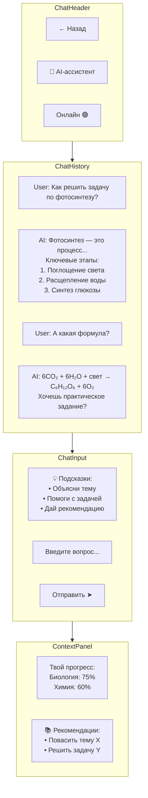

### 14.4) Teacher Dashboard
```mermaid
graph TB
    subgraph TeacherHeader
        Title[👨‍🏫 Панель учителя]
        Class[Класс: 10 \"А\" агрокласс]
        Students[Учеников: 24]
    end
    
    subgraph Overview
        AvgProgress[Средний прогресс: 68%]
        ActiveTasks[Активных заданий: 5]
        PendingReview[На проверке: 12 работ]
        AvgScore[Средняя оценка: 4.2]
    end
    
    subgraph StudentList
        S1[Иванов А. — 85% ✅]
        S2[Петров Б. — 72% ⚠️]
        S3[Сидорова В. — 45% ❗Нужна помощь]
        S4[Козлов Г. — 91% 🏆]
        More[... ещё 20 учеников]
    end
    
    subgraph Actions
        CreateTask[➕ Создать задание]
        Review[📋 Проверить работы (12)]
        Analytics[📊 Аналитика класса]
        Message[✉️ Сообщения]
        Export[📤 Экспорт отчётов]
    end
    
    subgraph RecentActivity
        A1[Иванов сдал задачу по биологии]
        A2[Петров получил достижение]
        A3[Сидорова отстаёт по химии]
    end
    
    subgraph AIInsights
        AI[💡 AI рекомендация:<br/>3 ученикам нужна помощь по теме \"Генетика\"<br/>Предлагаем дополнительное занятие]
    end
    
    TeacherHeader --> Overview
    Overview --> StudentList
    StudentList --> Actions
    Actions --> RecentActivity
    RecentActivity --> AIInsights
```

## 15) Activity Diagram — процессы выполнения задач и развития фермы
```mermaid
activityDiagram
    start
    :Ученик входит в систему;
    if (Есть активные задания?) then (да)
        :Выбирает задание;
        :Изучает условие;
        if (Нужна помощь?) then (да)
            :Обращается к AI-чату;
            :Получает подсказку;
        else (нет)
        endif
        :Выполняет задание;
        :Загружает решение;
        :Отправляет на проверку;
        
        if (Автоматическая проверка?) then (да)
            :Система проверяет;
            :Начисляет XP;
            :Обновляет прогресс;
        else (ручная учителем)
            :Ожидание проверки;
            :Учитель проверяет;
            :Выставляет оценку;
            :Начисляет XP;
        endif
        
        if (Достаточно XP для уровня?) then (да)
            :Повышение уровня;
            :Открытие новых зон фермы;
        else (нет)
        endif
        
        if (Выполнено условие достижения?) then (да)
            :Разблокировка достижения;
            :Показ уведомления;
            :Награда бонусами;
        else (нет)
        endif
        
        :Переход на ферму;
        :Выбор действия;<
        if (Посадка растений?) then (да)
            :Выбор культуры;
            :Выбор зоны;
            :Посадка;
            :Запуск таймера роста;
        elseif (Уход за животными?) then (да)
            :Выбор животного;
            :Кормление/уход;
            :Получение продукции;
        elseif (Производство?) then (да)
            :Выбор рецепта;
            :Расход ресурсов;
            :Запуск производства;
        elseif (Сбор урожая?) then (да)
            :Сбор готовой продукции;
            :Пополнение ресурсов;
            :Получение XP;
        else (другое)
        endif
        
        :Обновление состояния фермы;
        :Сохранение прогресса;
        
    else (нет активных заданий)
        :Переход сразу на ферму;
        :Развитие фермы;
    endif
    
    :Возврат на Dashboard;
    stop
```

## 16) State Machine Diagram — состояния задач и достижений
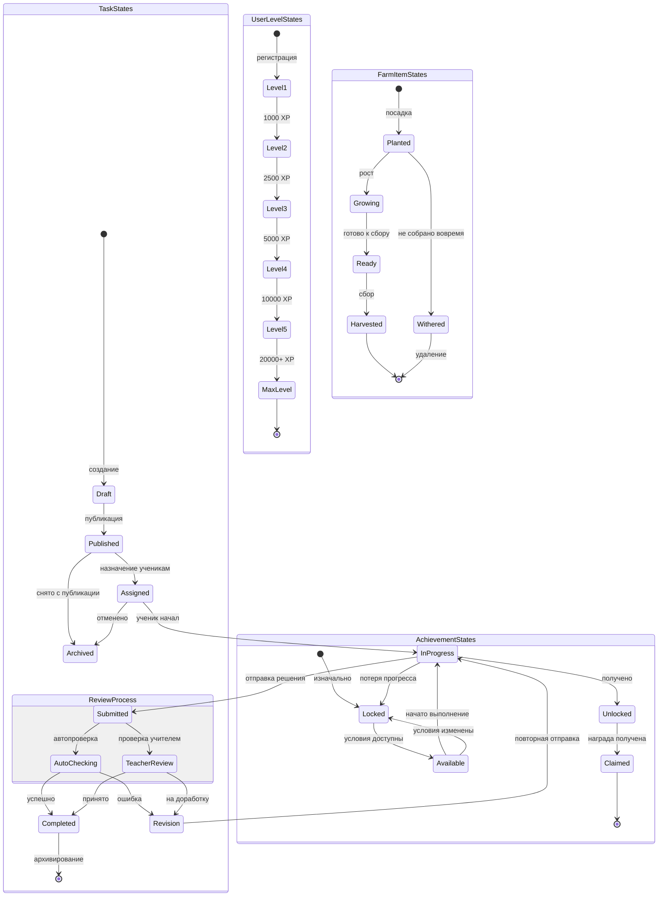

## 17) Class Diagram — ключевые классы системы
```mermaid
classDiagram
    class User {
        +id: UUID
        +email: string
        +passwordHash: string
        +role: UserRole
        +profile: Profile
        +createdAt: DateTime
        +login(email, password): Promise~AuthToken~
        +updateProfile(data): Promise~User~
    }
    
    class Profile {
        +id: UUID
        +userId: UUID
        +firstName: string
        +lastName: string
        +avatarUrl: string
        +currentLevel: number
        +currentXP: number
        +streak: number
        +groupId: UUID
        +gainXP(amount): Promise~void~
        +levelUp(): Promise~void~
    }
    
    class Task {
        +id: UUID
        +title: string
        +description: string
        +subject: Subject
        +difficulty: Difficulty
        +maxScore: number
        +dueDate: DateTime
        +zoneId: UUID
        +createSubmission(user, content): Promise~TaskSubmission~
    }
    
    class TaskSubmission {
        +id: UUID
        +taskId: UUID
        +userId: UUID
        +content: string
        +attachments: string[]
        +status: SubmissionStatus
        +score: number
        +feedback: string
        +submittedAt: DateTime
        +reviewedBy: UUID
        +submit(content): Promise~void~
        +updateStatus(status): Promise~void~
    }
    
    class Achievement {
        +id: UUID
        +name: string
        +description: string
        +iconUrl: string
        +criteria: AchievementCriteria
        +rewardXP: number
        +rewardItems: RewardItem[]
        +checkEligibility(user): Promise~boolean~
    }
    
    class UserAchievement {
        +id: UUID
        +userId: UUID
        +achievementId: UUID
        +unlockedAt: DateTime
        +isClaimed: boolean
        +claimReward(): Promise~void~
    }
    
    class FarmZone {
        +id: UUID
        +name: string
        +type: ZoneType
        +level: number
        +capacity: number
        +unlockLevel: number
        +upgrade(cost): Promise~void~
    }
    
    class FarmItem {
        +id: UUID
        +userId: UUID
        +zoneId: UUID
        +itemType: ItemType
        +plantedAt: DateTime
        +readyAt: DateTime
        +status: FarmItemStatus
        +harvest(): Promise~HarvestResult~
    }
    
    class Pet {
        +id: UUID
        +userId: UUID
        +petType: PetType
        +name: string
        +happiness: number
        +hunger: number
        +level: number
        +feed(): Promise~void~
        +play(): Promise~void~
        +updateState(): Promise~void~
    }
    
    class AIChatMessage {
        +id: UUID
        +userId: UUID
        +message: string
        +response: string
        +intent: IntentType
        +context: JSON
        +createdAt: DateTime
        +processRequest(): Promise~AIResponse~
    }
    
    class Group {
        +id: UUID
        +name: string
        +schoolName: string
        +teacherId: UUID
        +students: User[]
        +addStudent(user): Promise~void~
        +removeStudent(userId): Promise~void~
    }
    
    enum UserRole {
        STUDENT
        TEACHER
        ADMIN
    }
    
    enum SubmissionStatus {
        DRAFT
        SUBMITTED
        UNDER_REVIEW
        COMPLETED
        REVISION_NEEDED
    }
    
    enum FarmItemStatus {
        PLANTED
        GROWING
        READY
        HARVESTED
        WITHERED
    }
    
    User "1" --> "1" Profile
    User "1" --> "1" Group
    User "1" --> "n" TaskSubmission
    User "1" --> "n" UserAchievement
    User "1" --> "n" FarmItem
    User "1" --> "1" Pet
    User "1" --> "n" AIChatMessage
    
    Task "1" --> "n" TaskSubmission
    Task "1" --> "1" FarmZone
    
    Achievement "1" --> "n" UserAchievement
    
    FarmZone "1" --> "n" FarmItem
```

## 18) BPMN TO-BE (процесс с новым модулем)
```mermaid
flowchart TD
    Start([Начало обучения]) --> Login[Вход в EduFarm]
    Login --> Dashboard[Персональный Dashboard]
    
    Dashboard --> Check{Что делать?}
    
    Check -->|Задания| SelectTask[Выбор задания]
    SelectTask --> Study[Изучение материала]
    Study --> AIHelp{Нужна помощь?}
    AIHelp -- Да --> AIChat[AI-ассистент: объяснение]
    AIHelp -- Нет --> Solve[Решение задачи]
    AIChat --> Solve
    Solve --> Submit[Отправка решения]
    Submit --> AutoCheck{Автопроверка?}
    AutoCheck -- Да --> InstantFB[Мгновенная обратная связь]
    AutoCheck -- Нет --> TeacherWait[Ожидание проверки учителем]
    TeacherWait --> TeacherCheck[Учитель проверяет]
    TeacherCheck --> Feedback[Обратная связь]
    InstantFB --> Feedback
    
    Feedback --> XP[Начисление XP]
    XP --> Achieve{Достижение?}
    Achieve -- Да --> Unlock[Разблокировка достижения]
    Achieve -- Нет --> LevelUp{Новый уровень?}
    Unlock --> LevelUp
    LevelUp -- Да --> NewLevel[Повышение уровня + открытие зон]
    LevelUp -- Нет --> Farm[Переход на ферму]
    NewLevel --> Farm
    
    Farm --> FarmAction[Выбор действия]
    FarmAction -->|Посадить| Plant[Посадка культуры]
    FarmAction -->|Ухаживать| Care[Уход за животными]
    FarmAction -->|Произвести| Produce[Производство]
    FarmAction -->|Собрать| Harvest[Сбор урожая]
    
    Plant --> Timer[Таймер роста]
    Care --> Products[Получение продукции]
    Produce --> Crafts[Крафт предметов]
    Harvest --> Resources[Пополнение ресурсов]
    
    Timer --> Farm
    Products --> Farm
    Crafts --> Farm
    Resources --> Farm
    
    Farm --> Recs[AI-рекомендации]
    Recs --> PersonalPlan[Персональный план обучения]
    PersonalPlan --> Progress[Отслеживание прогресса]
    Progress --> Report[Еженедельный отчёт]
    Report --> End([Продолжение обучения])
```

## 19) IDEF0 — Контекстная диаграмма системы
```mermaid
graph LR
    subgraph Inputs
        I1[Образовательный контент]
        I2[Данные учеников]
        I3[Задания учителей]
        I4[Запросы пользователей]
    end
    
    subgraph Controls
        C1[ФГОС требования]
        C2[Политика безопасности]
        C3[Правила геймификации]
        C4[AI этические нормы]
    end
    
    A0[A0: Управление персональным трекингом и геймификацией обучения]
    
    subgraph Mechanisms
        M1[Backend NestJS]
        M2[Frontend React]
        M3[PostgreSQL]
        M4[AI-сервис FastAPI]
        M5[Kubernetes]
    end
    
    subgraph Outputs
        O1[Персонализированный прогресс]
        O2[Геймифицированные элементы]
        O3[AI-рекомендации]
        O4[Отчёты и аналитика]
        O5[Мотивация учеников]
    end
    
    I1 --> A0
    I2 --> A0
    I3 --> A0
    I4 --> A0
    
    C1 --> A0
    C2 --> A0
    C3 --> A0
    C4 --> A0
    
    A0 --> O1
    A0 --> O2
    A0 --> O3
    A0 --> O4
    A0 --> O5
    
    M1 -.-> A0
    M2 -.-> A0
    M3 -.-> A0
    M4 -.-> A0
    M5 -.-> A0
```

## 20) IDEF1X — Модель данных (упрощённая)
```mermaid
erDiagram
    USERS {
        uuid id PK
        varchar email UK
        varchar password_hash
        enum role
        timestamp created_at
    }
    
    PROFILES {
        uuid id PK
        uuid user_id FK
        varchar first_name
        varchar last_name
        varchar avatar_url
        int current_level
        int current_xp
        int streak
        uuid group_id FK
    }
    
    GROUPS {
        uuid id PK
        varchar name
        varchar school_name
        uuid teacher_id FK
    }
    
    TASKS {
        uuid id PK
        varchar title
        text description
        enum subject
        enum difficulty
        int max_score
        timestamp due_date
        uuid zone_id FK
    }
    
    TASK_SUBMISSIONS {
        uuid id PK
        uuid task_id FK
        uuid user_id FK
        text content
        json attachments
        enum status
        int score
        text feedback
        timestamp submitted_at
        uuid reviewed_by FK
    }
    
    ACHIEVEMENTS {
        uuid id PK
        varchar name
        varchar description
        varchar icon_url
        json criteria
        int reward_xp
    }
    
    USER_ACHIEVEMENTS {
        uuid id PK
        uuid user_id FK
        uuid achievement_id FK
        timestamp unlocked_at
        boolean is_claimed
    }
    
    FARM_ZONES {
        uuid id PK
        varchar name
        enum type
        int level
        int capacity
        int unlock_level
    }
    
    FARM_ITEMS {
        uuid id PK
        uuid user_id FK
        uuid zone_id FK
        enum item_type
        timestamp planted_at
        timestamp ready_at
        enum status
    }
    
    PETS {
        uuid id PK
        uuid user_id FK
        enum pet_type
        varchar name
        int happiness
        int hunger
        int level
    }
    
    AI_CHAT_MESSAGES {
        uuid id PK
        uuid user_id FK
        text message
        text response
        enum intent
        json context
        timestamp created_at
    }
    
    USERS ||--|| PROFILES : has
    USERS ||--o{ TASK_SUBMISSIONS : submits
    USERS ||--o{ USER_ACHIEVEMENTS : unlocks
    USERS ||--o{ FARM_ITEMS : owns
    USERS ||--o{ PETS : has
    USERS ||--o{ AI_CHAT_MESSAGES : sends
    USERS }o--|| GROUPS : belongs_to
    
    TASKS ||--o{ TASK_SUBMISSIONS : receives
    ACHIEVEMENTS ||--o{ USER_ACHIEVEMENTS : awarded_to
    FARM_ZONES ||--o{ FARM_ITEMS : contains
    GROUPS ||--o{ USERS : contains
```

## 21) DFD — Диаграмма потоков данных (Level 0)
```mermaid
graph TB
    subgraph ExternalEntities
        Student[👨‍🎓 Ученик]
        Teacher[👨‍🏫 Учитель]
        Admin[👤 Администратор]
        AISystem[🤖 Внешняя AI-система]
    end
    
    subgraph Processes
        P1[P1: Авторизация и управление доступом]
        P2[P2: Управление задачами]
        P3[P3: Трекинг прогресса]
        P4[P4: Геймификация и достижения]
        P5[P5: Управление фермой]
        P6[P6: AI-ассистент и рекомендации]
        P7[P7: Аналитика и отчётность]
    end
    
    subgraph DataStores
        DS1[(DS1: Пользователи и профили)]
        DS2[(DS2: Задачи и submissions)]
        DS3[(DS3: Прогресс и XP)]
        DS4[(DS4: Достижения)]
        DS5[(DS5: Ферма и питомцы)]
        DS6[(DS6: AI история и контекст)]
        DS7[(DS7: Логи и метрики)]
    end
    
    Student -->|Логин данные| P1
    Teacher -->|Логин данные| P1
    Admin -->|Логин данные| P1
    
    P1 --> DS1
    DS1 --> P1
    
    Student -->|Запрос задач| P2
    Teacher -->|Создание задач| P2
    P2 --> DS2
    DS2 --> P2
    
    P2 -->|Результаты| P3
    P3 --> DS3
    DS3 --> P3
    
    P3 -->|Прогресс| P4
    P4 --> DS4
    DS4 --> P4
    
    Student -->|Действия фермы| P5
    P5 --> DS5
    DS5 --> P5
    
    Student -->|Вопросы| P6
    P6 --> AISystem
    AISystem -->|Ответы| P6
    P6 --> DS6
    DS6 --> P6
    P6 -->|Рекомендации| P3
    
    Teacher -->|Запрос аналитики| P7
    P7 --> DS3
    P7 --> DS7
    P7 -->|Отчёты| Teacher
    P7 -->|Отчёты| Admin
    
    classDef entity fill:#ffcc80,stroke:#e65100
    classDef process fill:#90caf9,stroke:#0d47a1
    classDef store fill:#c8e6c9,stroke:#1b5e20
    
    class Student,Teacher,Admin,AISystem entity
    class P1,P2,P3,P4,P5,P6,P7 process
    class DS1,DS2,DS3,DS4,DS5,DS6,DS7 store
```

## 22) eEPC — Расширенная цепочка процессов
```mermaid
graph TD
    Start((Start)) --> Event1[Ученик входит в систему]
    Event1 --> Func1[Аутентификация пользователя]
    Func1 --> Event2{Успешный вход?}
    
    Event2 -- Да --> Event3[Доступ к Dashboard открыт]
    Event2 -- Нет --> Event4[Ошибка входа]
    Event4 --> EndFail((End))
    
    Event3 --> Func2[Загрузка персональных данных]
    Func2 --> Event5[Данные загружены]
    
    Event5 --> Decision1{Есть активные задания?}
    Decision1 -- Да --> Func3[Выполнение задания]
    Decision1 -- Нет --> Func4[Развитие фермы]
    
    Func3 --> Event6[Задание выполнено]
    Event6 --> Func5[Отправка на проверку]
    Func5 --> Decision2{Тип проверки?}
    
    Decision2 -- Авто --> Func6[Автоматическая проверка]
    Decision2 -- Учитель --> Event7[Ожидание проверки]
    Event7 --> Func7[Учитель проверяет]
    Func7 --> Event8[Проверка завершена]
    
    Func6 --> Event9[Результат получен]
    Event8 --> Event9
    
    Event9 --> Decision3{Положительный результат?}
    Decision3 -- Да --> Func8[Начисление XP]
    Decision3 -- Нет --> Func9[Возврат на доработку]
    Func9 --> Func3
    
    Func8 --> Event10[XP начислены]
    Event10 --> Decision4{Достаточно для уровня?}
    Decision4 -- Да --> Func10[Повышение уровня]
    Decision4 -- Нет --> Decision5{Есть достижение?}
    
    Func10 --> Event11[Уровень повышен]
    Event11 --> Decision5
    
    Decision5 -- Да --> Func11[Разблокировка достижения]
    Decision5 -- Нет --> Func12[Переход к ферме]
    
    Func11 --> Event12[Достижение получено]
    Event12 --> Func12
    
    Func12 --> Func13[Действие с фермой]
    Func13 --> Event14[Состояние фермы обновлено]
    Event14 --> Func14[Сохранение прогресса]
    Func14 --> Event15[Прогресс сохранён]
    Event15 --> EndSuccess((End Success))
    
    style Event1 fill:#fff9c4
    style Event3 fill:#c8e6c9
    style Event9 fill:#c8e6c9
    style Event15 fill:#c8e6c9
    style Func8 fill:#bbdefb
    style Func10 fill:#bbdefb
    style Func11 fill:#bbdefb
```

## 23) SADT (ARIS) — Функциональная модель
```mermaid
graph TB
    subgraph A0_Context
        direction TB
        InputTop[Входящие: Контент, Данные, Запросы]
        ControlLeft[Управляющие: Стандарты, Правила, Политики]
        
        subgraph Decomposition
            A1[A1: Управление пользователями]
            A2[A2: Управление обучением]
            A3[A3: Геймификация]
            A4[A4: AI-сервисы]
        end
        
        OutputRight[Исходящие: Прогресс, Отчёты, Рекомендации]
        MechBottom[Механизмы: Серверы, БД, Сеть]
    end
    
    InputTop --> A1
    InputTop --> A2
    InputTop --> A3
    InputTop --> A4
    
    ControlLeft --> A1
    ControlLeft --> A2
    ControlLeft --> A3
    ControlLeft --> A4
    
    A1 --> A2
    A2 --> A3
    A3 --> A4
    A4 --> A2
    
    A1 --> OutputRight
    A2 --> OutputRight
    A3 --> OutputRight
    A4 --> OutputRight
    
    MechBottom -.-> A1
    MechBottom -.-> A2
    MechBottom -.-> A3
    MechBottom -.-> A4
    
    classDef context fill:#e3f2fd,stroke:#1565c0
    classDef func fill:#ffe0b2,stroke:#ef6c00
    classDef io fill:#f3e5f5,stroke:#7b1fa2
    classDef mech fill:#e8f5e9,stroke:#2e7d32
    
    class A0_Context context
    class A1,A2,A3,A4 func
    class InputTop,OutputRight io
    class MechBottom mech
```

## 24) UML Communication Diagram — взаимодействие при выполнении задания
```mermaid
graph LR
    subgraph Participants
        S[👨‍🎓 Student]
        FE[🖥️ Frontend]
        API[⚙️ Backend API]
        DB[(🗄️ Database)]
        AI[🤖 AI Service]
        WS[📡 WebSocket]
    end
    
    S -->|1: Выбирает задание| FE
    FE -->|2: GET /tasks/:id| API
    API -->|3: Query task| DB
    DB -->|4: Task data| API
    API -->|5: Task + context| FE
    FE -->|6: Показ задания| S
    
    S -->|7: Вводит решение| FE
    FE -->|8: POST /tasks/:id/submit| API
    API -->|9: Save submission| DB
    DB -->|10: Confirm| API
    
    API -->|11: Check if auto| API
    API -->|12: Process with AI| AI
    AI -->|13: Evaluation result| API
    
    API -->|14: Update progress| DB
    API -->|15: Add XP| DB
    API -->|16: Check achievements| DB
    
    API -->|17: Emit via WS| WS
    WS -->|18: Real-time update| FE
    FE -->|19: Show result| S
    
    classDef human fill:#ffcdd2,stroke:#c62828
    classDef ui fill:#bbdefb,stroke:#1565c0
    classDef backend fill:#c8e6c9,stroke:#2e7d32
    classDef data fill:#fff9c4,stroke:#f9a825
    classDef ai fill:#e1bee7,stroke:#7b1fa2
    classDef ws fill:#ffe0b2,stroke:#ef6c00
    
    class S human
    class FE ui
    class API,WS backend
    class DB data
    class AI ai
```

## 25) UML Timing Diagram — временная диаграмма запроса
```mermaid
gantt
    title Временная диаграмма: AI-запрос от ученика
    dateFormat X
    axisFormat %Lмс
    
    section User
    Ввод вопроса           :0, 100
    Ожидание ответа        :100, 2500
    Получение ответа       :2500, 2600
    Чтение ответа          :2600, 5000
    
    section Frontend
    Перехват ввода         :50, 100
    Отправка запроса       :100, 150
    Отображение loader     :150, 2500
    Рендер ответа          :2500, 2600
    
    section Backend
    Приём запроса          :150, 200
    Валидация              :200, 300
    Извлечение контекста   :300, 600
    Запрос к AI            :600, 2200
    Постобработка          :2200, 2400
    Отправка ответа        :2400, 2500
    
    section AI Service
    Получение промпта      :600, 650
    LLM инференс           :650, 2100
    Формирование ответа    :2100, 2200
    
    section Database
    Запрос профиля         :300, 400
    Запрос прогресса       :400, 500
    Запрос истории         :500, 600
    Логирование            :2400, 2500
```

## 26) ARIS Organizational Chart — организационная структура
```mermaid
graph TB
    subgraph NationalProject[Нацпроект «Кадры в АПК»]
        NP[Координатор нацпроекта]
    end
    
    subgraph Ministry[Министерство сельского хозяйства]
        Minister[Министр]
        Dept[Департамент образования]
    end
    
    subgraph Region[Региональное управление]
        RegionalDir[Региональный директор]
        Methodologist[Методист]
    end
    
    subgraph School[Школа]
        Principal[Директор школы]
        VicePrincipal[Зам. директора по УР]
        
        subgraph AgroClass[Агрокласс]
            Teacher[Учитель агрокласса]
            LabAssistant[Лаборант]
        end
    end
    
    subgraph Platform[Платформа EduFarm]
        ProductOwner[Product Owner]
        DevTeam[Команда разработки]
        Support[Техподдержка]
    end
    
    subgraph Users[Пользователи]
        Students[Ученики 10-11 классов]
        Parents[Родители]
    end
    
    NP --> Minister
    Minister --> Dept
    Dept --> RegionalDir
    RegionalDir --> Methodologist
    Methodologist --> Principal
    Principal --> VicePrincipal
    VicePrincipal --> Teacher
    Teacher --> LabAssistant
    
    Platform --> Teacher
    Platform --> Students
    Teacher --> Students
    Students --> Parents
    
    DevTeam --> Support
    Support --> Teacher
    Support --> Students
    
    classDef gov fill:#e3f2fd,stroke:#1976d2
    classDef school fill:#fff3e0,stroke:#f57c00
    classDef platform fill:#e8f5e9,stroke:#388e3c
    classDef users fill:#fce4ec,stroke:#c2185b
    
    class NationalProject,Ministry,Region gov
    class School,school
    class Platform,platform
    class Users,users
```
"
